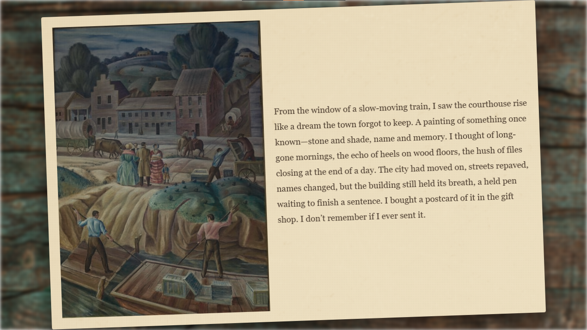
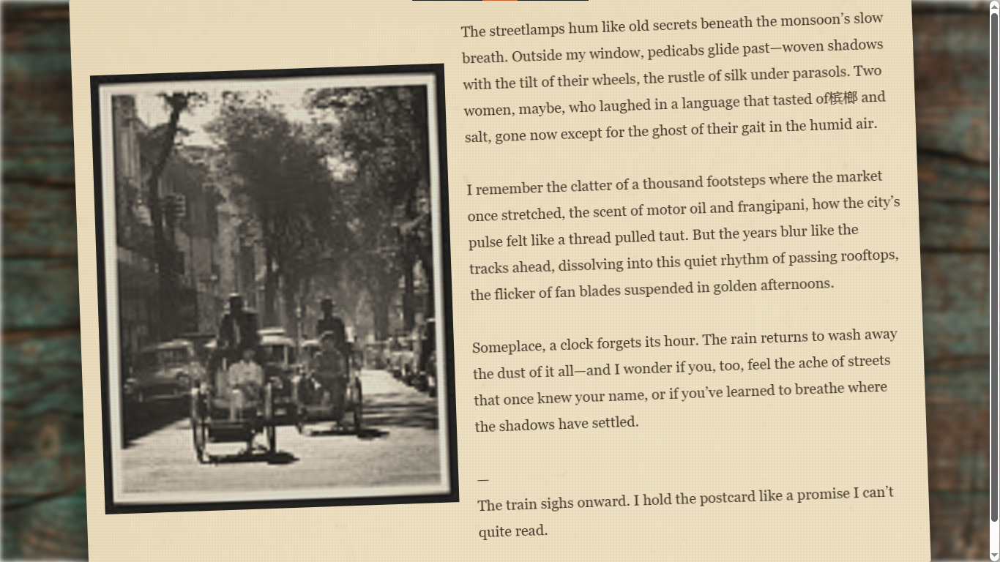
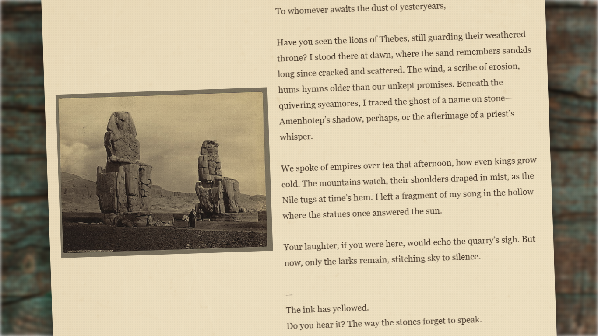

# Dust and Ink

It is a Procedurally generating vintage postcard built using historic photographs from the library of congress.

Dust and Ink transforms forgotten archived images into atmospherical digital postcards, selecting random photographs from the library with AI-generated poetic writing inspired by the location, time period, and mood of the image.

## Preview





## About

This was created as an experiment in combining history, procedural storytelling and vintage web designing.

Each visit generates a completely unique postcard using:

- a randomly selected historical image from Library of Congress
- AI- generated postcard writing
- randomized narrative styles and perspectives
- atmospheric visual story telling inspired by aged paper on a worn wooden table and forgotten memories

The goal of the project is to evoke the emotions by rediscovering fragments of forgotten stories decades later

## Features

- Random historical photographs from the library of congress API
- Procedurally generated postcard experiences
- AI-written vintage postcard messages
- Randomized narrative styles and perspectives

## Tech Stack

### Frontend

- HTML
- CSS
- JavaScript

### Backend

- Node.js
- Express.js

### APIs and services

- Library of Congress API
- Hack Club AI API

## Instructions

1. Clone this repository

```bash
git clone https://github.com/Prajwal-747/Dust-and-Ink.git
```

2. Open terminal in Project folder

3. Install dependencies

```bash
npm install
```

4. Create a `.env` file in the project folder and paste ur api key as:

```env
apikey=your_api_key_here
```

5. start server

```bash
node server.js
```

6. Open http://localhost:3000
